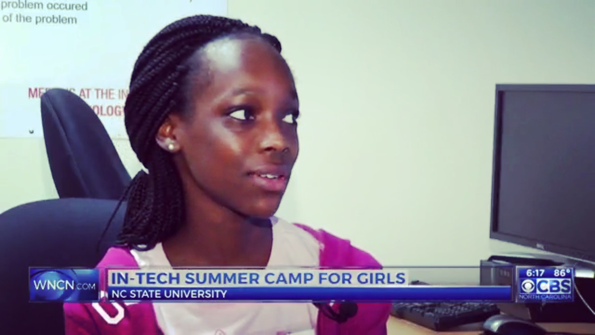

<!-- <h4>INTech in the news</h4>
        
This is <b>bold</b> and this is <strong>strong</strong>. This is <i>italic</i> and this is <em>emphasized</em>.
        This is superscript text and this is subscript text.
        This is <u>underlined</u> and this is code: <code>for (;;) { ... }</code>. Finally, <a href="#">this is a link</a>.

        
 -->

        
        <header>
          <h4>“Department Launches Alumni Hall of Fame”</h4>
          
INTech Founder & Board Member recognized as Destinguished Young Alumni

        </header>
        
As part of the department’s 50th Year celebrations, the Computer Science Alumni Hall of Fame was officially launched during a special ceremony held at the Park Alumni Center on Thursday, October 12th.  The event was attended by more than 120 faculty, staff, award winners and their family and special guests. <a href="http://intech.camp/cscncsuya" target="_blank">Read More</a>

        

        <header>
          <h4>“Camp that teaches girls to code, build websites comes to Raleigh for first time”</h4>
          
WCNC CBS Raleigh news crew visit for 6pm news clip

        </header>
        
<!--  -->Just a week or two out of school and some middle school students are back in the classroom — on a college campus. The room full of middle school girls on North Carolina State University’s campus aren’t playing games or posting on social media, they’re learning to build their own websites. <a href="http://intech.camp/cbsraleigh" target="_blank">Watch Now</a>

        

        <header>
          <h4>“INTech camp teaches code, offers role models”</h4>
          
NC State College of Engineering News

        </header>
        
Khalia Braswell, a 2013 NC State computer science graduate, started a nonprofit organization called INTech to expose middle-school aged girls to coding. INTech has hosted several camps in Charlotte, as well as numerous cities in South Carolina and California, and held its first camp at NC State in June. Several current students from and recent graduates of the Department of Computer Science volunteered to work the camp. <a href="http://intech.camp/ncsu-coenews" target="_blank">Read More</a>

        

        <header>
          <h4>“Robots, Women in STEM, and the Future of Work”</h4>
          
Red Ventures - Employee Feature

        </header>
        
This year, to my surprise, I received an email from INTech saying I’d been identified as one of their inspiring people. They wanted me to speak with a group of middle school girls at a mini-camp to be held during Engineers Week, Feb 19–25, 2017. I jumped at the opportunity. And it was awesome! INTech Camp does very important work in inspiring young girls — but nationally, there’s still a lot of work to be done.<a href="http://intech.camp/BlankaRV" target="_blank"> Read More</a>

        

        

        <!-- <header>
          <h4>“INTech Introduces 192 Scholars to Tech During Engineers Week”</h4>
          
WCNC CBS Raleigh news crew visit for 6pm news clip

        </header>
        
During Engineers Week 2017 (February 18-25), INTech introduced 192 scholars (151 girls and 41 boys) to the world of technology through 10 Mini-Camps at three middle schools in Charlotte, NC, one elementary school in Concord, NC, and two in Oakland, CA.</a>

        
 -->

